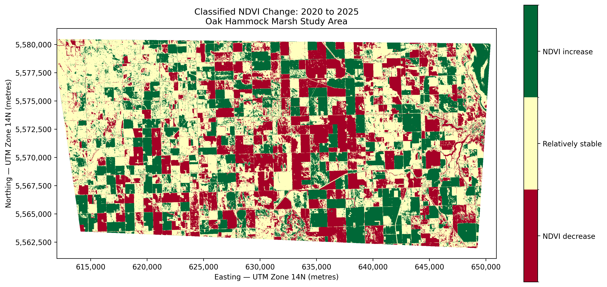

# Monitoring Wetland Vegetation Change in Manitoba Using Satellite Imagery and Python

## Overview

This project uses Sentinel-2 satellite imagery, GIS, remote sensing, and Python to examine vegetation change in the Oak Hammock Marsh region of Manitoba, Canada.

The analysis compares imagery acquired in August 2020 and August 2025 using the Normalized Difference Vegetation Index (NDVI). The workflow includes raster inspection, spatial-grid alignment, NDVI calculation, multi-temporal change detection, change classification, area statistics, and geospatial output generation.

This project is being developed as a portfolio case study demonstrating practical skills in:

* Geospatial analysis
* Remote sensing
* Environmental data science
* Raster processing
* Python programming
* Reproducible analytical workflows
* Environmental data visualization

> **Project status:** The initial NDVI calculation, multi-temporal change detection, classification, and area-statistics stages are complete. Wetland-specific analysis and dashboard development are planned next.

---

## Study Area

The study area includes Oak Hammock Marsh and surrounding agricultural land north of Winnipeg, Manitoba.

The broader area was selected to provide a mix of wetland vegetation, open water, agricultural land, roads, and other land-cover types. Future analysis will use an authoritative wetland or protected-area boundary to isolate changes specifically within the wetland environment.

---

## Environmental Question

The project explores the following question:

> How did satellite-observed vegetation conditions change across the Oak Hammock Marsh study area between August 2020 and August 2025?

The analysis identifies areas with lower, relatively stable, or higher NDVI values. These categories represent spectral vegetation change and should not automatically be interpreted as confirmed ecological degradation or improvement.

---

## Data

### Satellite imagery

The project uses Sentinel-2 Level-2A surface-reflectance imagery obtained through the Copernicus Data Space Browser.

| Date           | Sensor product      | Red band | Near-infrared band |
| -------------- | ------------------- | -------- | ------------------ |
| August 8, 2020 | Sentinel-2 Level-2A | B04      | B08                |
| August 2, 2025 | Sentinel-2 Level-2A | B04      | B08                |

The dates were selected from similar periods of the summer growing season to reduce seasonal differences.

### Spatial properties

* Coordinate reference system: **WGS 84 / UTM Zone 14N**
* EPSG code: **EPSG:32614**
* Exported analysis-grid resolution: approximately **16 metres**
* Comparison direction: **2025 NDVI − 2020 NDVI**

The Copernicus Browser’s fixed-size analytical export produced an approximately 16-metre output grid rather than the native 10-metre Sentinel-2 grid.

---

## Methodology

### 1. Raster inspection

The Red and near-infrared bands were inspected to confirm:

* Coordinate reference system
* Raster dimensions
* Pixel resolution
* Geographic bounds
* Affine transformation
* Data type
* NoData values

Within each acquisition date, B04 and B08 shared the same spatial grid.

### 2. NDVI calculation

NDVI was calculated using:

```text
NDVI = (NIR - Red) / (NIR + Red)
```

Where:

* `NIR` is Sentinel-2 Band 8
* `Red` is Sentinel-2 Band 4

General NDVI interpretation:

| NDVI range | General interpretation                |
| ---------: | ------------------------------------- |
|    Below 0 | Water or other non-vegetated surfaces |
| 0.0 to 0.2 | Bare soil or developed surfaces       |
| 0.2 to 0.5 | Sparse or moderate vegetation         |
|  Above 0.5 | Dense or actively growing vegetation  |

These ranges are general guidelines and are not wetland-health classifications.

### 3. Raster alignment

Although both acquisition dates used EPSG:32614, their dimensions, resolution, bounds, and affine transformations differed.

The 2020 Red and near-infrared bands were therefore resampled onto the exact 2025 reference grid using bilinear resampling. Bilinear resampling was selected because satellite reflectance values are continuous measurements.

### 4. Common valid area

Only pixels containing valid observations in both years were retained for the comparison.

* Valid overlapping coverage: **81.84%**
* Common valid comparison area: **64,896.03 hectares**

This prevents missing pixels or differences in coverage from being interpreted as environmental change.

### 5. NDVI change

The continuous change raster was calculated as:

```text
NDVI change = NDVI 2025 − NDVI 2020
```

Interpretation:

* Negative values indicate lower NDVI in 2025.
* Values near zero indicate relatively little difference.
* Positive values indicate higher NDVI in 2025.

### 6. Exploratory change classification

The continuous change values were grouped into three exploratory classes:

| Class             | Definition                 |
| ----------------- | -------------------------- |
| NDVI decrease     | Change below −0.10         |
| Relatively stable | Change from −0.10 to +0.10 |
| NDVI increase     | Change above +0.10         |

The ±0.10 threshold reduces the influence of small differences related to image timing, atmospheric conditions, resampling, and other sources of variability.

---

## Preliminary Results

### Mean NDVI over the common valid area

| Date           |   Mean NDVI |
| -------------- | ----------: |
| August 8, 2020 |      0.5956 |
| August 2, 2025 |      0.6009 |
| Difference     | **+0.0053** |

The mean NDVI increased by approximately **0.0053** across the common valid area. This represents a very small positive overall difference.

### Classified NDVI change

| Change class      |     Area (ha) |  Percentage |
| ----------------- | ------------: | ----------: |
| NDVI decrease     |     17,391.08 |      26.80% |
| Relatively stable |     29,729.07 |      45.81% |
| NDVI increase     |     17,775.88 |      27.39% |
| **Total**         | **64,896.03** | **100.00%** |

The largest class was **relatively stable**, representing approximately **45.81%** of the valid comparison area.

NDVI increase and decrease were nearly balanced:

* NDVI increase: **27.39%**
* NDVI decrease: **26.80%**
* Difference: **0.59 percentage points**
* Approximately **384.80 hectares** more area was classified as increasing than decreasing.

These findings support the mean-change result: the broader study area was relatively stable overall, with a very small positive shift but substantial localized variation.

---

## Visual Outputs

### NDVI — August 2020


### NDVI — August 2025


### Continuous NDVI change


### Classified NDVI change



---

## Interpretation and Limitations

The results describe changes in satellite-observed NDVI across the broader study area. They do not yet demonstrate that Oak Hammock Marsh improved or degraded.

Possible reasons for NDVI differences include:

* Agricultural crop rotation
* Differences in crop growth stages
* Changes in water levels
* Flooding or drying
* Weather conditions
* Soil moisture
* Land-cover conversion
* Image quality and atmospheric conditions
* Actual vegetation growth or loss

The study area includes substantial agricultural land and other non-wetland surfaces. These surrounding areas strongly influence the current summary statistics.

A wetland or protected-area boundary will be added in the next phase so that the same analysis can be repeated specifically within the wetland environment.

---

## Outputs

### Figures

```text
outputs/figures/
├── ndvi_2020.png
├── ndvi_2025.png
├── ndvi_change_2020_2025.png
└── ndvi_change_classes_2020_2025.png
```

### Tables

```text
outputs/tables/
└── ndvi_change_class_statistics.csv
```

### Analytical rasters generated locally

```text
data/processed/
├── ndvi_2020-08-08_aligned.tif
├── ndvi_2025-08-02.tif
├── ndvi_change_2020-2025.tif
└── ndvi_change_classes_2020-2025.tif
```

Raw imagery and generated GeoTIFF files are excluded from GitHub because of their size. They can be recreated by running the notebooks with the required source imagery.

---

## Project Structure

```text
wetland-change-manitoba/
│
├── data/
│   ├── raw/
│   │   └── sentinel2/
│   │       ├── 2020-08-08/
│   │       └── 2025-08-02/
│   ├── processed/
│   └── reference/
│       └── oak_hammock_study_area.geojson
│
├── notebooks/
│   ├── 01_inspect_and_ndvi.ipynb
│   └── 02_change_detection.ipynb
│
├── outputs/
│   ├── figures/
│   │   ├── ndvi_2020.png
│   │   ├── ndvi_2025.png
│   │   ├── ndvi_change_2020_2025.png
│   │   └── ndvi_change_classes_2020_2025.png
│   └── tables/
│       └── ndvi_change_class_statistics.csv
│
├── .gitignore
├── README.md
└── requirements.txt
```

---

## Notebooks

### 1. Sentinel-2 inspection and initial NDVI

[`01_inspect_and_ndvi.ipynb`](notebooks/01_inspect_and_ndvi.ipynb)

This notebook:

* Inspects the 2025 Sentinel-2 bands
* Confirms B04 and B08 alignment
* Calculates 2025 NDVI
* Visualizes the results
* Exports the 2025 NDVI GeoTIFF

### 2. Multi-temporal change detection

[`02_change_detection.ipynb`](notebooks/02_change_detection.ipynb)

This notebook:

* Creates the study-area boundary
* Loads the 2020 and 2025 imagery
* Compares raster grids
* Aligns 2020 imagery to the 2025 grid
* Calculates NDVI for both dates
* Identifies the common valid area
* Calculates continuous NDVI change
* Exports analytical GeoTIFF files
* Classifies NDVI change
* Calculates area and percentage statistics
* Exports publication-ready figures and a CSV summary

---

## Technologies Used

### Programming and data analysis

* Python
* NumPy
* Pandas
* Jupyter Notebook

### Geospatial processing

* Rasterio
* GeoPandas
* Shapely
* Rioxarray

### Visualization

* Matplotlib

### Planned dashboard

* Streamlit
* Folium

### Version control

* Git
* GitHub

---

## Skills Demonstrated

* Remote-sensing data acquisition
* Sentinel-2 image processing
* NDVI calculation
* Raster metadata inspection
* Coordinate-reference-system management
* Raster-grid comparison
* Resampling and spatial alignment
* NoData and masked-array handling
* Multi-temporal change detection
* Raster classification
* Area and percentage calculations
* GeoTIFF export and validation
* Geospatial visualization
* Reproducible notebook development
* Git and GitHub version control

---

## Setup

### 1. Clone the repository

```bash
git clone https://github.com/DiazHumberto/wetland-change-manitoba.git
cd wetland-change-manitoba
```

### 2. Create and activate a virtual environment

```bash
python3 -m venv venv
source venv/bin/activate
```

### 3. Upgrade pip

```bash
python -m pip install --upgrade pip
```

### 4. Install the project dependencies

```bash
pip install -r requirements.txt
```

### 5. Open the notebooks

Open the project in VS Code or launch Jupyter and select the Python interpreter inside the project virtual environment.

The raw Sentinel-2 files are not included in the repository and must be placed in the expected `data/raw/sentinel2/` folders before running the notebooks.

---

## Current Status

### Completed

* Python environment setup
* Sentinel-2 imagery acquisition
* Raster inspection
* Initial NDVI calculation
* Study-area GeoJSON creation
* Cross-date raster alignment
* Common-area masking
* Multi-temporal NDVI change detection
* GeoTIFF export and validation
* NDVI-change classification
* Area and percentage statistics
* CSV and PNG output generation

### Next phase

* Obtain an authoritative wetland or protected-area boundary
* Clip the analysis to the wetland area
* Recalculate change statistics within the wetland boundary
* Investigate extreme NDVI-change values
* Examine water and agricultural influences
* Add additional dates for time-series analysis
* Develop an interactive Streamlit dashboard

### Potential future AI extensions

* Land-cover classification using Random Forest
* Wetland-image segmentation
* Vegetation anomaly detection
* Multi-year NDVI forecasting
* Integration of satellite, weather, hydrological, and field data
* Automated environmental-change summaries

---

## Author

### Humberto Eleazar Díaz Maridueña

Environmental professional with a Bachelor of Environmental Engineering and experience in:

* Environmental science
* Ecological restoration
* Geographic Information Systems
* Remote sensing
* Artificial intelligence and machine learning
* Data science and statistical analysis
* Python programming

Professional interests include environmental monitoring, geospatial analytics, remote sensing, and the application of AI to sustainability and conservation challenges.

**Location:** Winnipeg, Manitoba, Canada

---

## Project Use

This project was created for educational, research, professional-development, and portfolio purposes.
